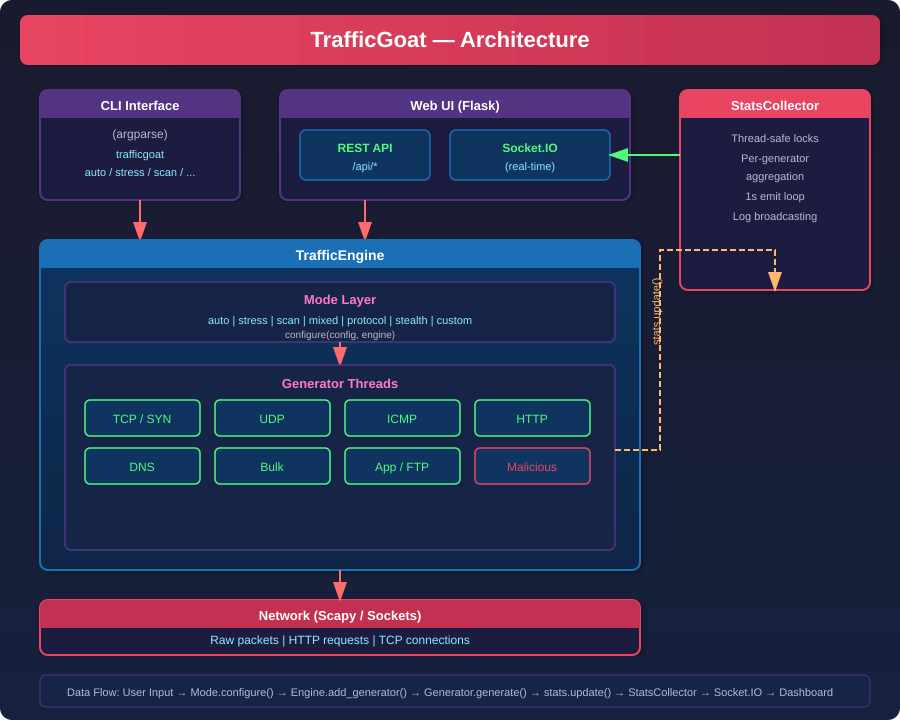

# TrafficGoat

Advanced network traffic generator for Linux - designed for firewall testing and log generation.

## Features

- **13 Traffic Generators**: TCP (SYN/connect/flags), UDP, ICMP, HTTP/HTTPS, DNS, Application (FTP/SSH/SMTP), Malicious patterns (gated), plus six "auto" generators: raw, bulk, HTTP, TCP-connect, curl, and SaaS.
- **~18 raw protocols** in auto mode: TCP, UDP, ICMP, DNS, NTP, SNMP, SIP, LDAP, MQTT, CoAP, RTSP, TFTP, NFS, STUN, SMB, RDP, plus exotic variants.
- **8 Subcommands**: `auto`, `stress`, `scan`, `mixed`, `protocol`, `stealth`, `custom`, `web`.
- **Dual Interface**: Full CLI + Web UI with real-time dashboard, generate page, modes overview, live logs.
- **Live Statistics**: Packets/s, bytes/s, per-generator breakdowns via Socket.IO (auto-updates every second).
- **Prometheus `/metrics` endpoint** for scraping by observability stacks.
- **High Bandwidth**: Bulk data generators produce gigabytes of traffic using large UDP payloads.
- **Safe-by-default targeting**: only loopback / RFC1918 / link-local / ULA destinations are allowed; public IPs require an explicit opt-in (`--allow-public`).
- **Token-protected web API**: an auth token is generated on startup (or set via `TRAFFICGOAT_TOKEN`).
- **Highly Configurable**: YAML configs, per-generator rate control, port ranges.

## Architecture Overview



## Requirements

- Linux (Debian/Ubuntu)
- Python 3.10+
- Root privileges (raw sockets)

## Installation

```bash
git clone <repo-url> && cd trafficgoat
sudo ./install.sh
```

Or manually:

```bash
pip install -r requirements.txt
pip install -e .
```

## CLI Usage

```bash
# Auto mode - zero-config, high bandwidth to thousands of destinations
sudo trafficgoat auto -l heavy -d 300
sudo trafficgoat auto -l medium -d 120
sudo trafficgoat auto -l light -d 60

# Stress test - all traffic types at high rate (private target by default)
sudo trafficgoat stress -t 192.168.1.1 -d 60 -r 500

# Port scan simulation
sudo trafficgoat scan -t 10.0.0.1 -p 1-1024

# Realistic mixed traffic
sudo trafficgoat mixed -t 192.168.1.1 -r 200 -d 120

# Single protocol test
sudo trafficgoat protocol -t 192.168.1.1 --protocol icmp -d 30

# Low-and-slow stealth test
sudo trafficgoat stealth -t 192.168.1.1 -d 300

# Custom config
sudo trafficgoat custom -t 192.168.1.1 -c configs/example.yaml

# Dry run (no packets sent)
sudo trafficgoat stress -t 192.168.1.1 --dry-run

# Hitting a public IP requires explicit opt-in
sudo trafficgoat stress -t 198.51.100.10 --allow-public

# Aggressive "malicious" patterns are gated behind a separate flag
sudo trafficgoat protocol -t 192.168.1.1 --protocol tcp --enable-malicious
```

## Web UI

```bash
# Bind defaults to 127.0.0.1; use --host 0.0.0.0 only when you mean it.
sudo trafficgoat web --web-port 8080
```

On startup, if `TRAFFICGOAT_TOKEN` isn't set, the server generates a token and
writes it to a `0600` file under `$XDG_RUNTIME_DIR` (falling back to
`/run/trafficgoat` or the system tempdir) — only the *path* is printed, never
the token itself, so it can't leak into syslog / container log aggregators.
Read it with `cat <path>` and pass it as `Authorization: Bearer <token>`,
`X-Auth-Token: <token>`, or `?token=<token>`.

Pin a stable token via the environment to skip the generated file:

```bash
export TRAFFICGOAT_TOKEN="your-long-random-token"
export TRAFFICGOAT_SECRET_KEY="another-long-random-secret"
sudo -E trafficgoat web --web-port 8080
```

Set `TRAFFICGOAT_TOKEN=""` (empty string) to disable auth entirely — only do this
on a trusted, isolated network. The server logs a warning when auth is off.

**Socket.IO CORS** is pinned to the configured `host:port` by default and is
*not* widened by `--allow-public` (which only affects the *target* allowlist).
To allow cross-origin dashboard access, set
`TRAFFICGOAT_CORS_ORIGINS="http://dash.example.com,http://other.example.com"`
(or `*` if you really want to open it).

**Rate limiting** (in-memory, per-token-or-IP, per-endpoint):
`/api/start` 3/10s · `/api/stop` 5/10s · `/api/logs` 30/5s · `/api/history` 30/5s.
Excess requests get `429` with a `Retry-After` header. Request bodies are
capped at 1 MiB.

The Web UI provides:

- **Dashboard**: Real-time statistics, start/stop controls, per-generator breakdown.
- **Generate**: One-click runs with mode/duration/rate selection.
- **Modes**: Visual overview of all available modes.
- **Logs**: Live log streaming with auto-scroll.

### Web API

All endpoints require the auth token (unless explicitly disabled):

| Endpoint            | Method | Purpose                                |
| ------------------- | ------ | -------------------------------------- |
| `/api/start`        | POST   | Start a traffic run                    |
| `/api/stop`         | POST   | Stop the current run                   |
| `/api/status`       | GET    | Current engine + stats snapshot        |
| `/api/modes`        | GET    | List available modes                   |
| `/api/logs`         | GET    | Recent log lines                       |
| `/api/history`      | GET    | Past session summaries                 |
| `/api/version`      | GET    | TrafficGoat version                    |
| `/metrics`          | GET    | Prometheus-formatted metrics           |

## Modes

| Mode       | Description                                                                    |
| ---------- | ------------------------------------------------------------------------------ |
| `auto`     | Zero-config: multi-destination traffic to 1000s of targets with bulk bandwidth |
| `stress`   | High-volume: TCP SYN + UDP + ICMP + HTTP at max rate                           |
| `scan`     | Port scanning: SYN, FIN, and connect scans                                     |
| `mixed`    | Realistic: weighted distribution across all protocols                          |
| `protocol` | Single protocol with full parameter control                                    |
| `stealth`  | Low-and-slow with randomized timing                                            |
| `custom`   | User-defined via YAML config file                                              |
| `web`      | Start the Web UI                                                               |

### Auto Mode Load Presets

| Level    | PPS      | Destinations | Bulk Generators | Batch Size |
| -------- | -------- | ------------ | --------------- | ---------- |
| `light`  | ~2,000   | 500          | 4               | 500        |
| `medium` | ~10,000  | 1,500        | 8               | 1,000      |
| `heavy`  | ~50,000  | 3,000        | 16              | 2,000      |

Each bulk generator sends ~1,400-byte UDP packets in large batches for maximum
bandwidth. A 5-minute heavy run generates multiple gigabytes of traffic.

## Custom Configuration

See `configs/example.yaml` for a full example:

```yaml
target: "192.168.1.1"
duration: 120
generators:
  - type: tcp_syn
    ports: "80,443"
    rate: 200
    weight: 0.4
  - type: http
    ports: "80"
    rate: 100
    methods: [GET, POST]
    weight: 0.3
  - type: dns
    subtype: mixed
    rate: 50
    weight: 0.3
```

## CLI Options

```
Global Options (most modes):
  -t, --target           Target IP/hostname (required; must be private unless --allow-public)
  -p, --ports            Port(s): single, range, comma-separated (default: 80)
  -d, --duration         Duration in seconds (default: 60)
  -r, --rate             Packets per second (default: 100)
  --threads              Worker threads (default: 4)
  -i, --interface        Network interface
  -v, --verbose          Verbose output
  -q, --quiet            Minimal output
  --dry-run              Simulate without sending packets
  --allow-public         Permit non-private targets (default: deny)
  --enable-malicious     Permit gated malicious subtypes (bruteforce/ddos/amplification)

Web mode:
  --host                 Bind address (default: 127.0.0.1)
  --web-port             Listen port (default: 8080)
  --dev                  Use the unsafe werkzeug dev server (development only)
```

## Safety model

By default TrafficGoat refuses to send traffic to anything outside loopback,
RFC1918 (10/8, 172.16/12, 192.168/16), link-local (169.254/16), IPv6 loopback,
ULA (fc00::/7) and IPv6 link-local (fe80::/10). Hostnames are resolved (A + AAAA)
and **every** returned address must pass the check — a hostname that resolves to
a mix of public and private addresses is rejected.

To hit a public target you must pass `--allow-public` explicitly, and aggressive
attack patterns (`bruteforce`, `ddos`, `amplification`) additionally require
`--enable-malicious`. Plain `portscan` does not.

## Contributing

If you change a generator, mode, CLI flag, web endpoint, env var, or dependency,
**update both `README.md` and `CLAUDE.md`** in the same PR. The checklist lives at
the bottom of [`CLAUDE.md`](./CLAUDE.md#keeping-docs-in-sync).

## Disclaimer

This tool is intended for **authorized security testing, firewall validation, and log generation** only. Only use against systems you own or have explicit permission to test. Unauthorized use against third-party systems is illegal.
